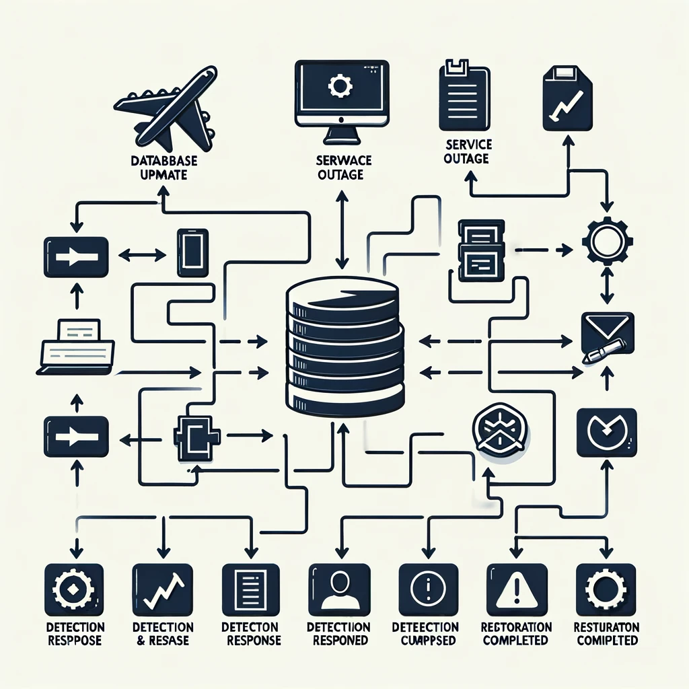
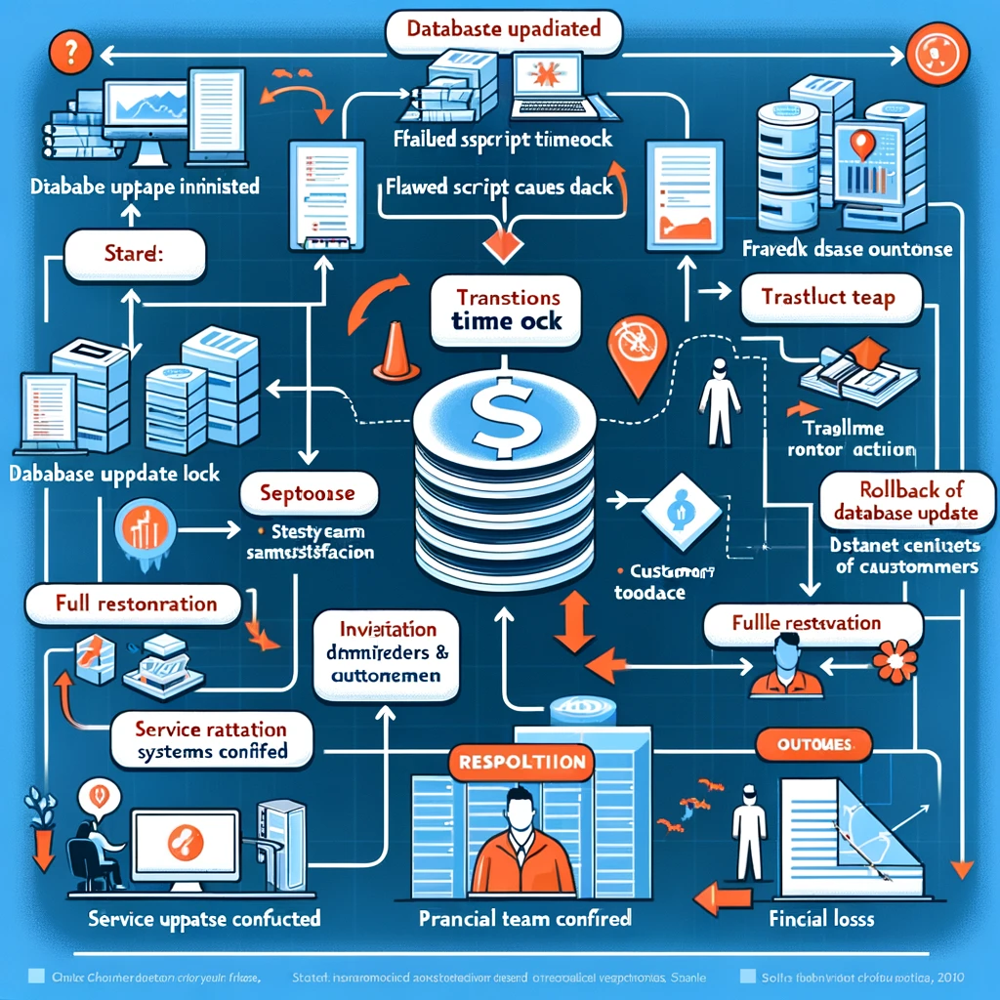

# Incident Report: Outage of XYZ Online Payment System

## Incident Details
- **Incident ID:** IR20240413
- **Date/Time of Incident:** April 13, 2024, 09:32 AM - 10:47 AM UTC
- **Report Prepared by:** Jane Doe, Incident Manager
- **Reviewed by:** John Smith, CTO

## Introduction
On April 13, 2024, at approximately 09:32 AM UTC, the XYZ Online Payment System experienced a complete service outage. The issue was detected by our automated monitoring systems and confirmed by customer reports of inability to process payments.

## Summary of the Incident
The outage was caused by a failure in the database update process, which led to a cascade of timeouts in the payment processing service. This incident affected approximately 12,000 transactions, potentially impacting customer trust and resulting in an estimated $200,000 in lost revenue.

## Timeline
- **09:32 AM UTC** - Outage detected by monitoring systems.
- **09:35 AM UTC** - Incident response team alerted.
- **09:40 AM UTC** - Initial investigation identified database issues.
- **09:50 AM UTC** - Rollback of database update initiated.
- **10:20 AM UTC** - System functionality partially restored.
- **10:47 AM UTC** - Full system restoration confirmed, monitoring continued.

## Impact Analysis
Direct Impact: Failure of the payment processing system, affecting approximately 12,000 transactions.
Indirect Impact: Customer dissatisfaction, potential brand damage, estimated financial loss of approximately $200,000.
Data Loss: No data was lost, but data processing was delayed during the outage period.

## Root Cause Analysis
The root cause was a flawed database migration script that locked critical tables, causing transaction timeouts. The script did not account for high load conditions during peak operational hours.

## Action Items and Remediations
1. **Database Migration Review Process**
   - **Action:** Implement a peer review process for all database changes.
   - **Responsible:** Database Engineering Team
   - **Deadline:** May 1, 2024
2. **Enhanced Monitoring for Database Operations**
   - **Action:** Deploy additional monitoring tools to track database performance during migrations.
   - **Responsible:** IT Operations Team
   - **Deadline:** May 15, 2024
3. **Customer Communication Strategy**
   - **Action:** Develop a proactive customer communication plan for any future outages.
   - **Responsible:** Customer Service Manager
   - **Deadline:** May 10, 2024

## Lessons Learned
Technical: The need for rigorous testing of database changes under load conditions was highlighted.
Process: The incident underscored the importance of having a robust rollback strategy for database migrations.
Positive: The effective response of the Incident Management team in quickly identifying and mitigating the impact of the outage was crucial in the rapid recovery.

## Flowchart Diagram

## Appendices and Supporting Information
- **Appendix A:** Database migration script review.
- **Appendix B:** Graphs showing system performance during the incident.
- **Appendix C:** Customer service reports and feedback during the outage.